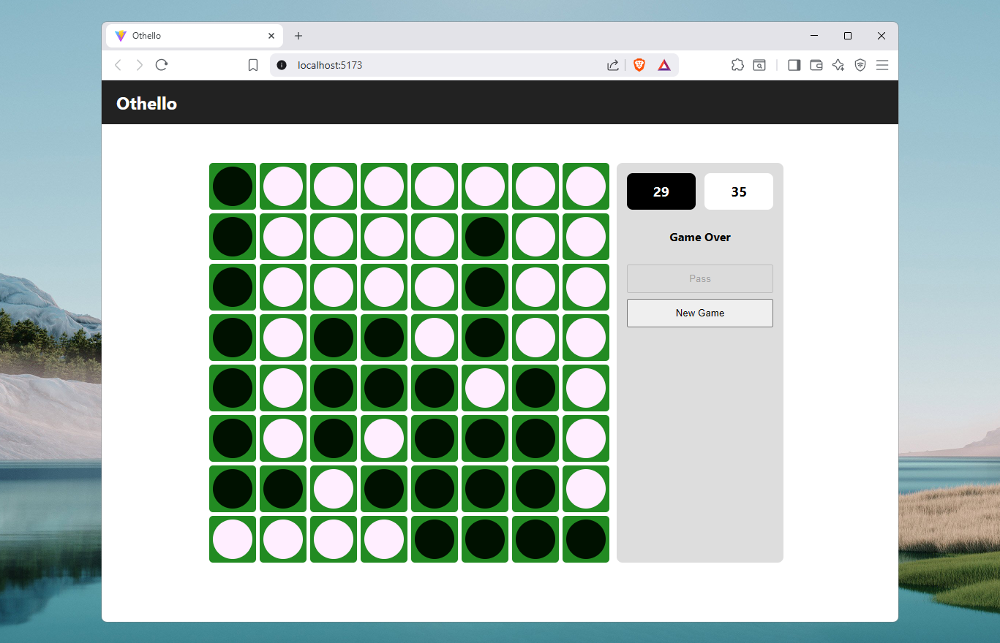

# Othello

A self-hosted application for playing Othello against a Convolutional Neural Network (CNN).



## System Design

The system is intended to be an orchestration of three containerized applications:

- **OthelloGameplaySPA** - A single-page application presenting a user interface for playing games of Othello against a computer opponent.
- **OthelloGameAPI** - A service tasked with maintaining the game state, performing game logic and making game events available to the frontend.
- **OthelloOpponentAPI** - A service tasked with using a trained deep learning model to identify strong moves for a given board state. 


## Usage

This project is a work in progress, and currently only supports playing against random move selection rather than a CNN model.

From the root of the repo, run ```docker compose up --build``` to launch the three applications:

1) Gameplay SPA @ http://localhost:5173/
2) Game API @ http://localhost:8080/othellogame/board
3) Opponent API @ http://localhost:5000/

## Broader Context

This project is part of a broader look into supervised machine learning as applied to Othello. A [notebook](https://www.kaggle.com/code/petermoorhouse/pytorch-othello-evaluation-cnn) for training the CNN model used in this project can be found on Kaggle. Also, I am running a community competition around the problem, "[Evaluate Othello Boards](https://www.kaggle.com/competitions/evaluate-othello-boards/overview)", which will be live until September 5th, 2025.

